<h1 align="center" style="border-bottom: none">
    NetApp ONTAP Universal Orchestrator Extension
</h1>

<p align="center">
  <!-- Badges -->

<a href="https://github.com/Keyfactor/netapp-ontap-orchestrator/releases"></a>


</p>

<p align="center">
  <!-- TOC -->
  <a href="#support">
    <b>Support</b>
  </a>
  ·
  <a href="#installation">
    <b>Installation</b>
  </a>
  ·
  <a href="#license">
    <b>License</b>
  </a>
  ·
  <a href="https://github.com/orgs/Keyfactor/repositories?q=orchestrator">
    <b>Related Integrations</b>
  </a>
</p>

## Overview

This NetApp ONTAP Orchestrator extension adds the ability to manage certificates on [NetApp ONTAP](https://www.netapp.com/data-management/ontap-data-management-software/) clusters and Storage VMs (SVMs) through Keyfactor Command, using the ONTAP REST API.

ONTAP maintains a certificate store on each cluster and on each SVM it hosts. This integration lets you inventory those certificates, add and remove them, and discover the scopes (cluster and SVMs) available on a cluster. It exposes two certificate store types that separate the two fundamentally different kinds of certificate ONTAP holds:

- **[ONTAP_CERTS](#ontap_certs)** — end-entity and signer certificates that carry a private key: ONTAP's own `server` certificates (used when ONTAP acts as an SSL server) and `client` certificates (used when ONTAP acts as an SSL client).
- **[ONTAP_TRUSTED](#ontap_trusted)** — trust anchors that are public certificates only: `server_ca` (trusted by ONTAP-as-client to verify external servers) and `client_ca` (trusted by ONTAP-as-server to verify incoming client certificates).

The split reflects a hard constraint of the ONTAP API: the two store types support different operations, and the private key of an existing certificate can never be read back out (see [Certificate types and private keys](#certificate-types-and-private-keys)).

The NetApp ONTAP Universal Orchestrator extension implements 2 Certificate Store Types. Depending on your use case, you may elect to use one, or both of these Certificate Store Types. Descriptions of each are provided below.
- [NetApp ONTAP Certificates](#ONTAP_CERTS)
- [NetApp ONTAP Trusted Roots](#ONTAP_TRUSTED)

## Compatibility

This integration is compatible with Keyfactor Universal Orchestrator version 10.4 and later.

## Support

The NetApp ONTAP Universal Orchestrator extension is community open source and there is **no SLA**. Keyfactor will address issues as resources become available.

> To report a problem or suggest a new feature, use the **[Issues](../../issues)** tab. If you want to contribute bug fixes or additional enhancements, use the **[Pull requests](../../pulls)** tab.

## Requirements & Prerequisites

Before installing the NetApp ONTAP Universal Orchestrator extension, we recommend that you install [kfutil](https://github.com/Keyfactor/kfutil). Kfutil is a command-line tool that simplifies the process of creating store types, installing extensions, and instantiating certificate stores in Keyfactor Command.

In order to use this integration, you should have:
- An instance of Keyfactor Command v11.0+
- An instance of the Keyfactor Universal Orchestrator v10.4+
- Network access from the Universal Orchestrator to the ONTAP cluster management LIF over HTTPS (443)
- An ONTAP account with sufficient privilege to read and manage certificates (see [Authentication](#authentication) and [Authorization / permissions](#authorization--permissions))
- ONTAP 9.6 or later (the REST API is required; this extension does not use the legacy ONTAPI/ZAPI interface)

### Authentication

This integration authenticates to the ONTAP REST API using HTTP Basic authentication. The credentials are supplied on the certificate store as the Server Username and Server Password, and both fields are PAM-eligible so they can be sourced from a configured Keyfactor PAM provider rather than stored directly.

The **ClientMachine** value on the certificate store is the cluster management hostname or IP address; the extension issues requests against `https://<ClientMachine>/api`.

> :warning: Use a dedicated, least-privilege service account rather than the built-in `admin` account. See [Authorization / permissions](#authorization--permissions).

Lab clusters and the [ONTAP Simulator](https://mysupport.netapp.com) present a self-signed TLS certificate. For those environments, enable the **Ignore SSL Warning** custom field on the certificate store (or the same-named job property on Discovery jobs) to skip TLS validation. Leave it disabled for production clusters that present a trusted certificate.

### Authorization / permissions

The service account used by the integration can only manage certificates in the scopes (cluster and/or SVMs) that its ONTAP role permits. Create an ONTAP role granting access to the certificate REST endpoints and assign it to the service account.

At minimum, the account's role needs access to:
- `GET /api/security/certificates` — inventory
- `POST /api/security/certificates` — add
- `DELETE /api/security/certificates/{uuid}` — remove
- `GET /api/svm/svms` — discovery (enumerate SVM scopes)

For details on creating roles and assigning REST API access in ONTAP, refer to the [ONTAP role-based access control documentation](https://docs.netapp.com/us-en/ontap/authentication/).

### Scope: cluster vs SVM

ONTAP is multi-tenant. A single cluster hosts a cluster (admin) context plus one or more SVMs, and **each maintains its own independent certificate store**. A certificate therefore lives in a specific scope — either cluster scope or a named SVM — and the same certificate name can exist independently in more than one scope.

This integration encodes the scope in the certificate store **Store Path**:
- Enter the **name of an SVM** (for example `vs0`) to manage that SVM's certificates.
- Enter the literal token **`[cluster]`** (including the square brackets) to manage cluster-scoped certificates.

The square brackets are intentional. ONTAP SVM names cannot contain square brackets, so `[cluster]` can never collide with a real SVM name, while still reading clearly as "cluster" in the Command store list.

> :warning: The bare word `cluster` is **not** the cluster token — it is treated as an ordinary SVM name. Only `[cluster]` (with brackets) selects cluster scope. This is deliberate: a cluster may legitimately contain an SVM named `cluster`, and it must remain addressable.

The **Discovery** job enumerates the scopes on a cluster — the cluster token plus one entry per SVM — so you can register the relevant scopes as certificate stores without listing them by hand.

### Certificate types and private keys

Each certificate in ONTAP has a `type`, and the two store types partition those types:

| Store type | ONTAP `type` values | Holds a private key? | Managed as |
| :--------- | :------------------ | :------------------- | :--------- |
| ONTAP_CERTS | `server`, `client` | Yes | End-entity / signer certificate |
| ONTAP_TRUSTED | `server_ca`, `client_ca` | No | Trust anchor (public certificate only) |

A newly provisioned cluster ships with a large set of certificates already present — self-signed `server` certificates for the cluster and each SVM, plus a substantial list of well-known public root CAs (stored as `server_ca`). This is expected; the pre-installed public roots account for most of the count you will see on a first inventory.

> :warning: **The ONTAP REST API never returns a private key on read.** The private key is write-only — supplied when a certificate is installed, and never retrievable afterward. Inventory therefore returns certificate metadata and the public certificate only; it cannot extract private keys from certificates already on the cluster.

The `root_ca` type (a local signing CA that ONTAP generates and uses to sign certificates) is intentionally **not** managed by either store type. A local CA must be generated on the appliance rather than installed, so it does not fit the Add flow; managing local CAs is out of scope for this release.

For store-type-specific configuration and examples, see the documentation for each store type: [ONTAP_CERTS](./ontap_certs.md) and [ONTAP_TRUSTED](./ontap_trusted.md).

## Certificate Store Types

To use the NetApp ONTAP Universal Orchestrator extension, you **must** create the Certificate Store Types required for your use-case. This only needs to happen _once_ per Keyfactor Command instance.

The NetApp ONTAP Universal Orchestrator extension implements 2 Certificate Store Types. Depending on your use case, you may elect to use one, or both of these Certificate Store Types.

### ONTAP_CERTS

<details><summary>Click to expand details</summary>

The ONTAP_CERTS certificate store type manages **end-entity and signer certificates** on an ONTAP cluster or SVM — that is, ONTAP certificates that carry a private key. These are the `server` certificates ONTAP presents when acting as an SSL server (management, NAS-over-TLS, and similar endpoints) and the `client` certificates ONTAP presents when acting as an SSL client to an external service.

For trust anchors (public CA certificates with no private key), use the [ONTAP_TRUSTED](./ontap_trusted.md) store type instead.

#### NetApp ONTAP Certificates Requirements

1. [Certificate Format](#certificate-format)
1. [Scope and the Store Path](#scope-and-the-store-path)
1. [Configuring the Certificate Store](#configuring-the-certificate-store)
1. [Supported Operations](#supported-operations)
1. [Example](#example)
1. [Troubleshooting](#troubleshooting)

---

##### Certificate Format

Certificates in this store are ONTAP certificates of type `server` or `client`, each consisting of a certificate (with its issuer chain) and a private key.

When adding a certificate from Keyfactor Command, the certificate and private key are installed together against the target scope. Because these are end-entity certificates, a private key is **required** on Add.

The `CertType` entry parameter selects which ONTAP type to install the entry as:

| CertType | Meaning |
| :------- | :------ |
| `server` | Certificate + private key used by ONTAP acting as an SSL **server**. |
| `client` | Certificate + private key used by ONTAP acting as an SSL **client**. |

> :warning: The private key of a certificate already present on the cluster **cannot** be retrieved through the ONTAP API. Inventory returns each certificate's metadata and public certificate only. This store type is therefore best used to *place* Command-managed certificates onto ONTAP and keep them current, rather than to import existing key material off the cluster.

---

##### Scope and the Store Path

The **Store Path** identifies the scope whose certificates the store manages:
- an **SVM name** (for example `vs0`) to manage that SVM's certificates, or
- the literal token **`[cluster]`** (square brackets included) to manage cluster-scoped certificates.

The **ClientMachine** is the cluster management hostname or IP; requests are issued against `https://<ClientMachine>/api`. See the [Overview](./content.md#scope-cluster-vs-svm) for a full explanation of scope, including why the bracketed `[cluster]` token is used.

---

##### Configuring the Certificate Store

| Field | Description |
| :---- | :---------- |
| ClientMachine | The ONTAP cluster management hostname or IP address. |
| StorePath | The scope: an SVM name, or `[cluster]` for cluster scope. |
| Server Username | ONTAP service account username (PAM-eligible). |
| Server Password | ONTAP service account password (PAM-eligible). |
| Ignore SSL Warning | Enable for lab clusters / the ONTAP Simulator that present a self-signed certificate. |

The certificate alias in Keyfactor Command maps to the ONTAP certificate **name**, which must be unique within a scope. A custom alias is required.

---

##### Supported Operations

| Operation | Behavior |
| :-------- | :------- |
| Inventory | Returns all `server` and `client` certificates in the store's scope. |
| Add | Installs a `server` or `client` certificate (with private key) into the scope, per the `CertType` entry parameter. If a certificate with the same name already exists in the scope, the Overwrite option must be set; the existing certificate is removed and the new one installed in its place. |
| Remove | Deletes the named certificate from the scope. |
| Discovery | Enumerates the scopes on the cluster (cluster + each SVM) as candidate store paths. |

> :warning: ONTAP has no in-place certificate "renew" operation. Renewal is performed as a replace: the new certificate is installed and the old one removed.

---

##### Example

To manage the certificates on SVM `vs0` of a cluster reachable at `ontap.example.com`:

- **ClientMachine**: `ontap.example.com`
- **StorePath**: `vs0`
- **Server Username / Password**: the ONTAP service account credentials
- Add a certificate with alias `web-tls`, selecting `CertType = server`, to install it as a server certificate on `vs0`.

To manage cluster-scoped certificates on the same cluster, create a second store with **StorePath** = `[cluster]`.

---

##### Troubleshooting

- **A duplicate-name Add fails**: certificate names are unique per scope. Enable Overwrite to replace an existing certificate of the same name, or choose a different alias.
- **TLS/connection errors against a lab cluster or the Simulator**: enable **Ignore SSL Warning** on the store.
- **Add rejected for `root_ca`**: local signing CAs are not installed via this integration; they must be generated on the appliance and are out of scope for this release.
- **Certificate lands in the wrong place**: confirm the Store Path. Cluster scope (`[cluster]`) and an SVM scope are independent stores; installing to one does not affect the other.

#### Supported Operations

| Operation    | Is Supported |
|--------------|--------------|
| Add          | ✅ Checked |
| Remove       | ✅ Checked |
| Discovery    | ✅ Checked |
| Reenrollment | 🔲 Unchecked |
| Create       | 🔲 Unchecked |

#### Store Type Creation

##### Using kfutil:
`kfutil` is a custom CLI for the Keyfactor Command API and can be used to create certificate store types.
For more information on [kfutil](https://github.com/Keyfactor/kfutil) check out the [docs](https://github.com/Keyfactor/kfutil?tab=readme-ov-file#quickstart)

   <details><summary>Click to expand ONTAP_CERTS kfutil details</summary>

   ##### Using online definition from GitHub:
   This will reach out to GitHub and pull the latest store-type definition
   ```shell
   # NetApp ONTAP Certificates
   kfutil store-types create ONTAP_CERTS
   ```

   ##### Offline creation using integration-manifest file:
   If required, it is possible to create store types from the [integration-manifest.json](./integration-manifest.json) included in this repo.
   You would first download the [integration-manifest.json](./integration-manifest.json) and then run the following command
   in your offline environment.
   ```shell
   kfutil store-types create --from-file integration-manifest.json
   ```
   </details>

#### Manual Creation
Below are instructions on how to create the ONTAP_CERTS store type manually in
the Keyfactor Command Portal

   <details><summary>Click to expand manual ONTAP_CERTS details</summary>

   Create a store type called `ONTAP_CERTS` with the attributes in the tables below:

   ##### Basic Tab
   | Attribute | Value | Description |
   | --------- | ----- | ----- |
   | Name | NetApp ONTAP Certificates | Display name for the store type (may be customized) |
   | Short Name | ONTAP_CERTS | Short display name for the store type |
   | Capability | ONTAP_CERTS | Store type name orchestrator will register with. Check the box to allow entry of value |
   | Supports Add | ✅ Checked | Indicates that the Store Type supports Management Add |
   | Supports Remove | ✅ Checked | Indicates that the Store Type supports Management Remove |
   | Supports Discovery | ✅ Checked | Indicates that the Store Type supports Discovery |
   | Supports Reenrollment | 🔲 Unchecked | Indicates that the Store Type supports Reenrollment |
   | Supports Create | 🔲 Unchecked | Indicates that the Store Type supports store creation |
   | Needs Server | ✅ Checked | Determines if a target server name is required when creating store |
   | Blueprint Allowed | 🔲 Unchecked | Determines if store type may be included in an Orchestrator blueprint |
   | Uses PowerShell | 🔲 Unchecked | Determines if underlying implementation is PowerShell |
   | Requires Store Password | 🔲 Unchecked | Enables users to optionally specify a store password when defining a Certificate Store. |
   | Supports Entry Password | 🔲 Unchecked | Determines if an individual entry within a store can have a password. |

   The Basic tab should look like this:

   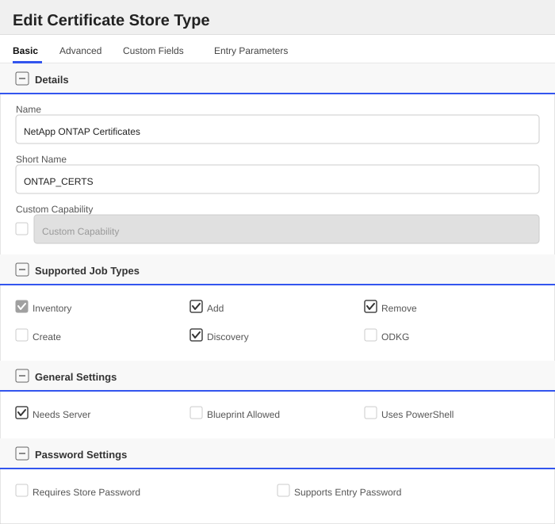

   ##### Advanced Tab
   | Attribute | Value | Description |
   | --------- | ----- | ----- |
   | Supports Custom Alias | Required | Determines if an individual entry within a store can have a custom Alias. |
   | Private Key Handling | Required | This determines if Keyfactor can send the private key associated with a certificate to the store. |
   | PFX Password Style | Default | 'Default' - PFX password is randomly generated, 'Custom' - PFX password may be specified when the enrollment job is created (Requires the Allow Custom Password application setting to be enabled.) |

   The Advanced tab should look like this:

   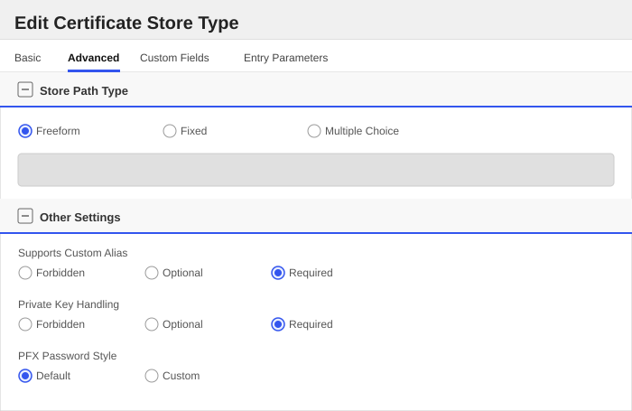

   > For Keyfactor **Command versions 24.4 and later**, a Certificate Format dropdown is available with PFX and PEM options. Ensure that **PFX** is selected, as this determines the format of new and renewed certificates sent to the Orchestrator during a Management job. Currently, all Keyfactor-supported Orchestrator extensions support only PFX.

   ##### Custom Fields Tab
   Custom fields operate at the certificate store level and are used to control how the orchestrator connects to the remote target server containing the certificate store to be managed. The following custom fields should be added to the store type:

   | Name | Display Name | Description | Type | Default Value/Options | Required |
   | ---- | ------------ | ---- | --------------------- | -------- | ----------- |
   | IgnoreSSLWarning | Ignore SSL Warning | When enabled, TLS certificate validation is skipped when connecting to the ONTAP management endpoint. Useful for lab clusters and the ONTAP Simulator, which present a self-signed certificate. Leave disabled for production clusters that present a trusted certificate. | Bool | false | 🔲 Unchecked |

   The Custom Fields tab should look like this:

   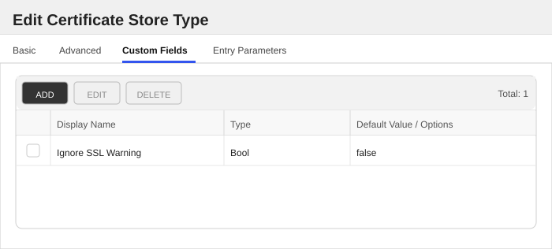

   ###### Ignore SSL Warning
   When enabled, TLS certificate validation is skipped when connecting to the ONTAP management endpoint. Useful for lab clusters and the ONTAP Simulator, which present a self-signed certificate. Leave disabled for production clusters that present a trusted certificate.

   
   


   ##### Entry Parameters Tab

   | Name | Display Name | Description | Type | Default Value | Entry has a private key | Adding an entry | Removing an entry | Reenrolling an entry |
   | ---- | ------------ | ---- | ------------- | ----------------------- | ---------------- | ----------------- | ------------------- | ----------- |
   | CertType | Certificate Type | The ONTAP certificate 'type' to install this entry as. 'server' installs a certificate + private key used by ONTAP acting as an SSL server; 'client' installs a certificate + private key used by ONTAP acting as an SSL client. Required when adding a certificate. | MultipleChoice | server | 🔲 Unchecked | ✅ Checked | 🔲 Unchecked | 🔲 Unchecked |

   The Entry Parameters tab should look like this:

   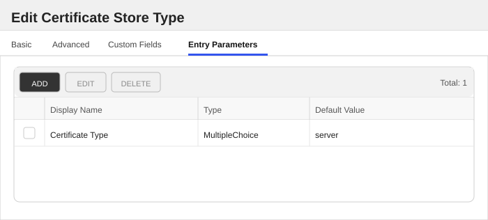
   ##### Certificate Type
   The ONTAP certificate 'type' to install this entry as. 'server' installs a certificate + private key used by ONTAP acting as an SSL server; 'client' installs a certificate + private key used by ONTAP acting as an SSL client. Required when adding a certificate.

   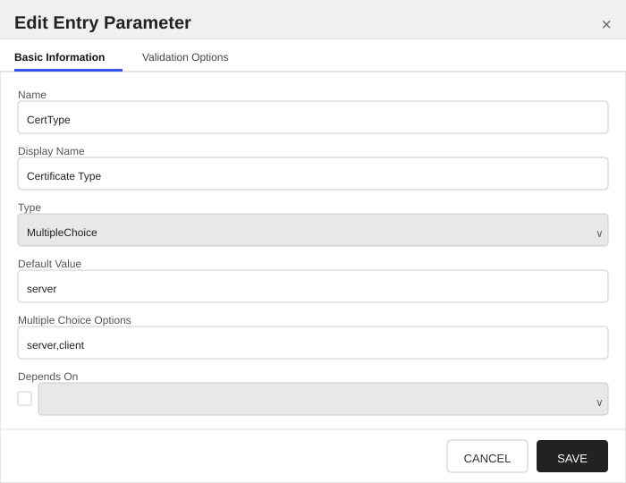
   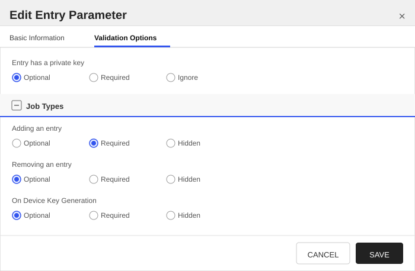


   </details>
</details>

### ONTAP_TRUSTED

<details><summary>Click to expand details</summary>

The ONTAP_TRUSTED certificate store type manages **trust anchors** on an ONTAP cluster or SVM — public CA certificates that ONTAP uses to verify other parties, with no private key. These are the `server_ca` certificates (trusted by ONTAP acting as an SSL client to verify an external server) and `client_ca` certificates (trusted by ONTAP acting as an SSL server to verify an incoming client certificate).

For end-entity certificates that carry a private key (ONTAP's own `server`/`client` certificates), use the [ONTAP_CERTS](./ontap_certs.md) store type instead.

#### NetApp ONTAP Trusted Roots Requirements

1. [Certificate Format](#certificate-format)
1. [Scope and the Store Path](#scope-and-the-store-path)
1. [Configuring the Certificate Store](#configuring-the-certificate-store)
1. [Supported Operations](#supported-operations)
1. [Managing pre-installed roots](#managing-pre-installed-roots)
1. [Example](#example)
1. [Troubleshooting](#troubleshooting)

---

##### Certificate Format

Certificates in this store are ONTAP certificates of type `server_ca` or `client_ca`. Each is a public certificate only — **no private key is installed**, and the store type forbids private key material.

The `CertType` entry parameter selects which ONTAP type to install the entry as:

| CertType | Meaning |
| :------- | :------ |
| `server_ca` | Trusted by ONTAP acting as an SSL **client**, to verify an external **server**'s certificate. |
| `client_ca` | Trusted by ONTAP acting as an SSL **server**, to verify an incoming **client** certificate. |

Choose the value that matches the trust direction you need; the two are not interchangeable.

---

##### Scope and the Store Path

The **Store Path** identifies the scope whose trust anchors the store manages:
- an **SVM name** (for example `vs0`) to manage that SVM's trust anchors, or
- the literal token **`[cluster]`** (square brackets included) to manage cluster-scoped trust anchors.

The **ClientMachine** is the cluster management hostname or IP; requests are issued against `https://<ClientMachine>/api`. See the [Overview](./content.md#scope-cluster-vs-svm) for a full explanation of scope.

---

##### Configuring the Certificate Store

| Field | Description |
| :---- | :---------- |
| ClientMachine | The ONTAP cluster management hostname or IP address. |
| StorePath | The scope: an SVM name, or `[cluster]` for cluster scope. |
| Server Username | ONTAP service account username (PAM-eligible). |
| Server Password | ONTAP service account password (PAM-eligible). |
| Ignore SSL Warning | Enable for lab clusters / the ONTAP Simulator that present a self-signed certificate. |

The certificate alias in Keyfactor Command maps to the ONTAP certificate **name**, which must be unique within a scope. A custom alias is required. Private keys are not permitted on this store type.

---

##### Supported Operations

| Operation | Behavior |
| :-------- | :------- |
| Inventory | Returns all `server_ca` and `client_ca` certificates in the store's scope. |
| Add | Installs a `server_ca` or `client_ca` public certificate into the scope, per the `CertType` entry parameter. If a trust anchor with the same name already exists in the scope, the Overwrite option must be set; the existing entry is removed and the new one installed in its place. |
| Remove | Deletes the named trust anchor from the scope. |
| Discovery | Enumerates the scopes on the cluster (cluster + each SVM) as candidate store paths. |

---

##### Managing pre-installed roots

A newly provisioned cluster ships with a large set of well-known public root CAs already present as `server_ca` certificates. These appear in inventory alongside any trust anchors you add, and that is expected.

Pre-installed roots are inventoried but **cannot be removed through this integration**. ONTAP blocks deletion of factory certificates server-side, returning an error that directs you to the ONTAP CLI. If a Remove job targets a pre-installed root, it fails with a clear message rather than causing any change. Trust anchors that you added through the integration can be removed normally.

> :information_source: Because ONTAP itself protects the built-in roots, there is no risk of the integration inadvertently deleting one. Removing or replacing a factory root, if genuinely required, is a deliberate CLI operation performed directly on the cluster.

---

##### Example

To manage the trust anchors on SVM `vs0` of a cluster reachable at `ontap.example.com`:

- **ClientMachine**: `ontap.example.com`
- **StorePath**: `vs0`
- **Server Username / Password**: the ONTAP service account credentials
- Add a public CA certificate with alias `corp-issuing-ca`, selecting `CertType = server_ca`, so ONTAP (as a client) will trust servers whose certificates chain to that CA.

To manage cluster-scoped trust anchors on the same cluster, create a second store with **StorePath** = `[cluster]`.

---

##### Troubleshooting

- **A duplicate-name Add fails**: trust anchor names are unique per scope. Enable Overwrite to replace an existing anchor of the same name, or choose a different alias.
- **Add rejected because a private key was supplied**: this store type manages public trust anchors only. Add certificates without private keys; use [ONTAP_CERTS](./ontap_certs.md) for certificates that carry a key.
- **Remove of a pre-installed root fails**: this is expected. ONTAP blocks deletion of factory-installed roots and directs you to the CLI; the integration surfaces that as a clear failure. Only trust anchors added through the integration can be removed here. See [Managing pre-installed roots](#managing-pre-installed-roots).
- **TLS/connection errors against a lab cluster or the Simulator**: enable **Ignore SSL Warning** on the store.

#### Supported Operations

| Operation    | Is Supported |
|--------------|--------------|
| Add          | ✅ Checked |
| Remove       | ✅ Checked |
| Discovery    | ✅ Checked |
| Reenrollment | 🔲 Unchecked |
| Create       | 🔲 Unchecked |

#### Store Type Creation

##### Using kfutil:
`kfutil` is a custom CLI for the Keyfactor Command API and can be used to create certificate store types.
For more information on [kfutil](https://github.com/Keyfactor/kfutil) check out the [docs](https://github.com/Keyfactor/kfutil?tab=readme-ov-file#quickstart)

   <details><summary>Click to expand ONTAP_TRUSTED kfutil details</summary>

   ##### Using online definition from GitHub:
   This will reach out to GitHub and pull the latest store-type definition
   ```shell
   # NetApp ONTAP Trusted Roots
   kfutil store-types create ONTAP_TRUSTED
   ```

   ##### Offline creation using integration-manifest file:
   If required, it is possible to create store types from the [integration-manifest.json](./integration-manifest.json) included in this repo.
   You would first download the [integration-manifest.json](./integration-manifest.json) and then run the following command
   in your offline environment.
   ```shell
   kfutil store-types create --from-file integration-manifest.json
   ```
   </details>

#### Manual Creation
Below are instructions on how to create the ONTAP_TRUSTED store type manually in
the Keyfactor Command Portal

   <details><summary>Click to expand manual ONTAP_TRUSTED details</summary>

   Create a store type called `ONTAP_TRUSTED` with the attributes in the tables below:

   ##### Basic Tab
   | Attribute | Value | Description |
   | --------- | ----- | ----- |
   | Name | NetApp ONTAP Trusted Roots | Display name for the store type (may be customized) |
   | Short Name | ONTAP_TRUSTED | Short display name for the store type |
   | Capability | ONTAP_TRUSTED | Store type name orchestrator will register with. Check the box to allow entry of value |
   | Supports Add | ✅ Checked | Indicates that the Store Type supports Management Add |
   | Supports Remove | ✅ Checked | Indicates that the Store Type supports Management Remove |
   | Supports Discovery | ✅ Checked | Indicates that the Store Type supports Discovery |
   | Supports Reenrollment | 🔲 Unchecked | Indicates that the Store Type supports Reenrollment |
   | Supports Create | 🔲 Unchecked | Indicates that the Store Type supports store creation |
   | Needs Server | ✅ Checked | Determines if a target server name is required when creating store |
   | Blueprint Allowed | 🔲 Unchecked | Determines if store type may be included in an Orchestrator blueprint |
   | Uses PowerShell | 🔲 Unchecked | Determines if underlying implementation is PowerShell |
   | Requires Store Password | 🔲 Unchecked | Enables users to optionally specify a store password when defining a Certificate Store. |
   | Supports Entry Password | 🔲 Unchecked | Determines if an individual entry within a store can have a password. |

   The Basic tab should look like this:

   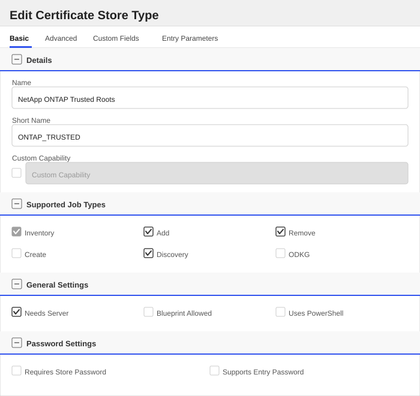

   ##### Advanced Tab
   | Attribute | Value | Description |
   | --------- | ----- | ----- |
   | Supports Custom Alias | Required | Determines if an individual entry within a store can have a custom Alias. |
   | Private Key Handling | Forbidden | This determines if Keyfactor can send the private key associated with a certificate to the store. |
   | PFX Password Style | Default | 'Default' - PFX password is randomly generated, 'Custom' - PFX password may be specified when the enrollment job is created (Requires the Allow Custom Password application setting to be enabled.) |

   The Advanced tab should look like this:

   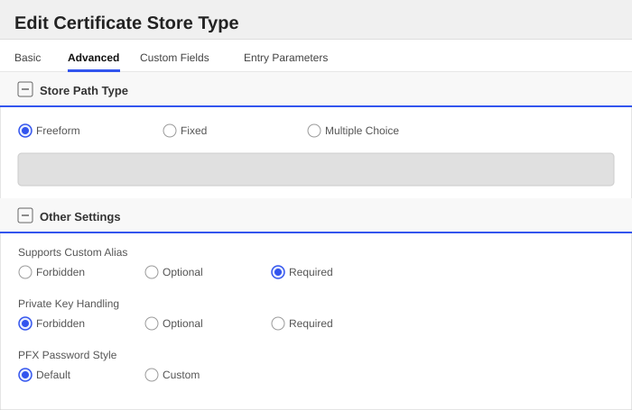

   > For Keyfactor **Command versions 24.4 and later**, a Certificate Format dropdown is available with PFX and PEM options. Ensure that **PFX** is selected, as this determines the format of new and renewed certificates sent to the Orchestrator during a Management job. Currently, all Keyfactor-supported Orchestrator extensions support only PFX.

   ##### Custom Fields Tab
   Custom fields operate at the certificate store level and are used to control how the orchestrator connects to the remote target server containing the certificate store to be managed. The following custom fields should be added to the store type:

   | Name | Display Name | Description | Type | Default Value/Options | Required |
   | ---- | ------------ | ---- | --------------------- | -------- | ----------- |
   | IgnoreSSLWarning | Ignore SSL Warning | When enabled, TLS certificate validation is skipped when connecting to the ONTAP management endpoint. Useful for lab clusters and the ONTAP Simulator, which present a self-signed certificate. Leave disabled for production clusters that present a trusted certificate. | Bool | false | 🔲 Unchecked |

   The Custom Fields tab should look like this:

   

   ###### Ignore SSL Warning
   When enabled, TLS certificate validation is skipped when connecting to the ONTAP management endpoint. Useful for lab clusters and the ONTAP Simulator, which present a self-signed certificate. Leave disabled for production clusters that present a trusted certificate.

   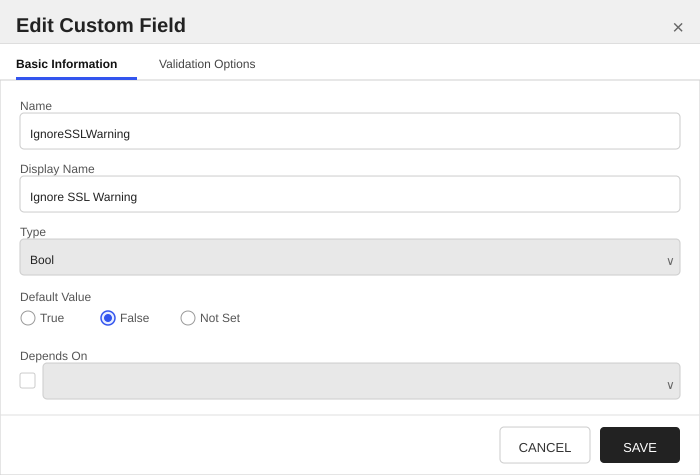
   


   ##### Entry Parameters Tab

   | Name | Display Name | Description | Type | Default Value | Entry has a private key | Adding an entry | Removing an entry | Reenrolling an entry |
   | ---- | ------------ | ---- | ------------- | ----------------------- | ---------------- | ----------------- | ------------------- | ----------- |
   | CertType | Certificate Type | The ONTAP trust-anchor 'type' to install this entry as. 'server_ca' is trusted by ONTAP acting as an SSL client to verify an external server; 'client_ca' is trusted by ONTAP acting as an SSL server to verify an incoming client certificate. Required when adding a certificate. Trust anchors are public certificates only; no private key is installed. | MultipleChoice | server_ca | 🔲 Unchecked | ✅ Checked | 🔲 Unchecked | 🔲 Unchecked |

   The Entry Parameters tab should look like this:

   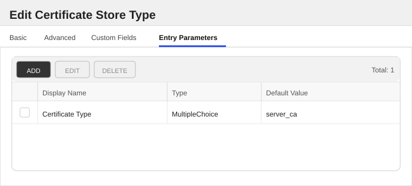
   ##### Certificate Type
   The ONTAP trust-anchor 'type' to install this entry as. 'server_ca' is trusted by ONTAP acting as an SSL client to verify an external server; 'client_ca' is trusted by ONTAP acting as an SSL server to verify an incoming client certificate. Required when adding a certificate. Trust anchors are public certificates only; no private key is installed.

   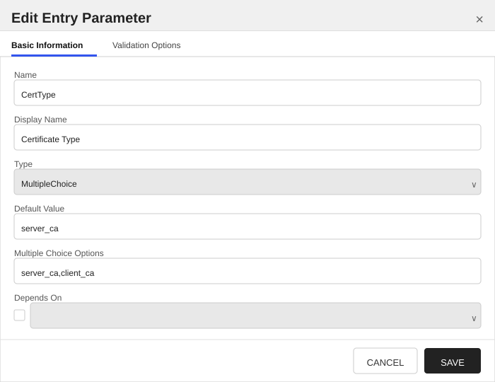
   


   </details>
</details>


## Installation

1. **Download the latest NetApp ONTAP Universal Orchestrator extension from GitHub.**

    Navigate to the [NetApp ONTAP Universal Orchestrator extension GitHub version page](https://github.com/Keyfactor/netapp-ontap-orchestrator/releases/latest). Refer to the compatibility matrix below to determine which asset should be downloaded. Then, click the corresponding asset to download the zip archive.

   | Universal Orchestrator Version | Latest .NET version installed on the Universal Orchestrator server | `rollForward` condition in `Orchestrator.runtimeconfig.json` | `netapp-ontap-orchestrator` .NET version to download |
   | --------- | ----------- | ----------- | ----------- |
   | Older than `11.0.0` | | | `net6.0` |
   | Between `11.0.0` and `11.5.1` (inclusive) | `net6.0` | | `net6.0` |
   | Between `11.0.0` and `11.5.1` (inclusive) | `net8.0` | `Disable` | `net6.0` |
   | Between `11.0.0` and `11.5.1` (inclusive) | `net8.0` | `LatestMajor` | `net8.0` |
   | `11.6` _and_ newer | `net8.0` | | `net8.0` |
   | `25.5` _and_ newer | `net10.0` | | `net10.0` |

    Unzip the archive containing extension assemblies to a known location.

    > **Note** If you don't see an asset with a corresponding .NET version, you should always assume that it was compiled for `net10.0`.

2. **Locate the Universal Orchestrator extensions directory.**

    * **Default on Windows** - `C:\Program Files\Keyfactor\Keyfactor Orchestrator\extensions`
    * **Default on Linux** - `/opt/keyfactor/orchestrator/extensions`

3. **Create a new directory for the NetApp ONTAP Universal Orchestrator extension inside the extensions directory.**

    Create a new directory called `netapp-ontap-orchestrator`.
    > The directory name does not need to match any names used elsewhere; it just has to be unique within the extensions directory.

4. **Copy the contents of the downloaded and unzipped assemblies from __step 2__ to the `netapp-ontap-orchestrator` directory.**

5. **Restart the Universal Orchestrator service.**

    Refer to [Starting/Restarting the Universal Orchestrator service](https://software.keyfactor.com/Core-OnPrem/Current/Content/InstallingAgents/NetCoreOrchestrator/StarttheService.htm).

6. **(optional) PAM Integration**

    The NetApp ONTAP Universal Orchestrator extension is compatible with all supported Keyfactor PAM extensions to resolve PAM-eligible secrets. PAM extensions running on Universal Orchestrators enable secure retrieval of secrets from a connected PAM provider.

    To configure a PAM provider, [reference the Keyfactor Integration Catalog](https://keyfactor.github.io/integrations-catalog/content/pam) to select an extension and follow the associated instructions to install it on the Universal Orchestrator (remote).

> The above installation steps can be supplemented by the [official Command documentation](https://software.keyfactor.com/Core-OnPrem/Current/Content/InstallingAgents/NetCoreOrchestrator/CustomExtensions.htm?Highlight=extensions).

## Defining Certificate Stores

The NetApp ONTAP Universal Orchestrator extension implements 2 Certificate Store Types, each of which implements different functionality. Refer to the individual instructions below for each Certificate Store Type that you deemed necessary for your use case from the installation section.

<details><summary>NetApp ONTAP Certificates (ONTAP_CERTS)</summary>

### Store Creation

#### Manually with the Command UI

<details><summary>Click to expand details</summary>

1. **Navigate to the _Certificate Stores_ page in Keyfactor Command.**

    Log into Keyfactor Command, toggle the _Locations_ dropdown, and click _Certificate Stores_.

2. **Add a Certificate Store.**

    Click the Add button to add a new Certificate Store. Use the table below to populate the **Attributes** in the **Add** form.

   | Attribute | Description |
   | --------- | ----------- |
   | Category | Select "NetApp ONTAP Certificates" or the customized certificate store name from the previous step. |
   | Container | Optional container to associate certificate store with. |
   | Client Machine |  |
   | Store Path | Identifies the scope on the cluster whose certificates this store manages. Enter the name of a Storage VM (SVM), e.g. 'vs0', to manage that SVM's certificates, or the literal token '[cluster]' (square brackets included) to manage cluster-scoped certificates. The ClientMachine is the cluster management hostname or IP. Run the Discovery job to enumerate the available scopes. |
   | Orchestrator | Select an approved orchestrator capable of managing `ONTAP_CERTS` certificates. Specifically, one with the `ONTAP_CERTS` capability. |
   | IgnoreSSLWarning | When enabled, TLS certificate validation is skipped when connecting to the ONTAP management endpoint. Useful for lab clusters and the ONTAP Simulator, which present a self-signed certificate. Leave disabled for production clusters that present a trusted certificate. |

</details>

#### Using kfutil CLI

<details><summary>Click to expand details</summary>

1. **Generate a CSV template for the ONTAP_CERTS certificate store**

    ```shell
    kfutil stores import generate-template --store-type-name ONTAP_CERTS --outpath ONTAP_CERTS.csv
    ```
2. **Populate the generated CSV file**

    Open the CSV file, and reference the table below to populate parameters for each **Attribute**.

   | Attribute | Description |
   | --------- | ----------- |
   | Category | Select "NetApp ONTAP Certificates" or the customized certificate store name from the previous step. |
   | Container | Optional container to associate certificate store with. |
   | Client Machine |  |
   | Store Path | Identifies the scope on the cluster whose certificates this store manages. Enter the name of a Storage VM (SVM), e.g. 'vs0', to manage that SVM's certificates, or the literal token '[cluster]' (square brackets included) to manage cluster-scoped certificates. The ClientMachine is the cluster management hostname or IP. Run the Discovery job to enumerate the available scopes. |
   | Orchestrator | Select an approved orchestrator capable of managing `ONTAP_CERTS` certificates. Specifically, one with the `ONTAP_CERTS` capability. |
   | Properties.IgnoreSSLWarning | When enabled, TLS certificate validation is skipped when connecting to the ONTAP management endpoint. Useful for lab clusters and the ONTAP Simulator, which present a self-signed certificate. Leave disabled for production clusters that present a trusted certificate. |

3. **Import the CSV file to create the certificate stores**

    ```shell
    kfutil stores import csv --store-type-name ONTAP_CERTS --file ONTAP_CERTS.csv
    ```

</details>

#### PAM Provider Eligible Fields
<details><summary>Attributes eligible for retrieval by a PAM Provider on the Universal Orchestrator</summary>

If a PAM provider was installed _on the Universal Orchestrator_ in the [Installation](#Installation) section, the following parameters can be configured for retrieval _on the Universal Orchestrator_.

   | Attribute | Description |
   | --------- | ----------- |
   | ServerUsername | Username to use when connecting to server |
   | ServerPassword | Password to use when connecting to server |

Please refer to the **Universal Orchestrator (remote)** usage section ([PAM providers on the Keyfactor Integration Catalog](https://keyfactor.github.io/integrations-catalog/content/pam)) for your selected PAM provider for instructions on how to load attributes orchestrator-side.
> Any secret can be rendered by a PAM provider _installed on the Keyfactor Command server_. The above parameters are specific to attributes that can be fetched by an installed PAM provider running on the Universal Orchestrator server itself.

</details>

> The content in this section can be supplemented by the [official Command documentation](https://software.keyfactor.com/Core-OnPrem/Current/Content/ReferenceGuide/Certificate%20Stores.htm?Highlight=certificate%20store).

</details>

<details><summary>NetApp ONTAP Trusted Roots (ONTAP_TRUSTED)</summary>

### Store Creation

#### Manually with the Command UI

<details><summary>Click to expand details</summary>

1. **Navigate to the _Certificate Stores_ page in Keyfactor Command.**

    Log into Keyfactor Command, toggle the _Locations_ dropdown, and click _Certificate Stores_.

2. **Add a Certificate Store.**

    Click the Add button to add a new Certificate Store. Use the table below to populate the **Attributes** in the **Add** form.

   | Attribute | Description |
   | --------- | ----------- |
   | Category | Select "NetApp ONTAP Trusted Roots" or the customized certificate store name from the previous step. |
   | Container | Optional container to associate certificate store with. |
   | Client Machine |  |
   | Store Path | Identifies the scope on the cluster whose trusted certificates this store manages. Enter the name of a Storage VM (SVM), e.g. 'vs0', to manage that SVM's trust anchors, or the literal token '[cluster]' (square brackets included) to manage cluster-scoped trust anchors. The ClientMachine is the cluster management hostname or IP. Run the Discovery job to enumerate the available scopes. |
   | Orchestrator | Select an approved orchestrator capable of managing `ONTAP_TRUSTED` certificates. Specifically, one with the `ONTAP_TRUSTED` capability. |
   | IgnoreSSLWarning | When enabled, TLS certificate validation is skipped when connecting to the ONTAP management endpoint. Useful for lab clusters and the ONTAP Simulator, which present a self-signed certificate. Leave disabled for production clusters that present a trusted certificate. |

</details>

#### Using kfutil CLI

<details><summary>Click to expand details</summary>

1. **Generate a CSV template for the ONTAP_TRUSTED certificate store**

    ```shell
    kfutil stores import generate-template --store-type-name ONTAP_TRUSTED --outpath ONTAP_TRUSTED.csv
    ```
2. **Populate the generated CSV file**

    Open the CSV file, and reference the table below to populate parameters for each **Attribute**.

   | Attribute | Description |
   | --------- | ----------- |
   | Category | Select "NetApp ONTAP Trusted Roots" or the customized certificate store name from the previous step. |
   | Container | Optional container to associate certificate store with. |
   | Client Machine |  |
   | Store Path | Identifies the scope on the cluster whose trusted certificates this store manages. Enter the name of a Storage VM (SVM), e.g. 'vs0', to manage that SVM's trust anchors, or the literal token '[cluster]' (square brackets included) to manage cluster-scoped trust anchors. The ClientMachine is the cluster management hostname or IP. Run the Discovery job to enumerate the available scopes. |
   | Orchestrator | Select an approved orchestrator capable of managing `ONTAP_TRUSTED` certificates. Specifically, one with the `ONTAP_TRUSTED` capability. |
   | Properties.IgnoreSSLWarning | When enabled, TLS certificate validation is skipped when connecting to the ONTAP management endpoint. Useful for lab clusters and the ONTAP Simulator, which present a self-signed certificate. Leave disabled for production clusters that present a trusted certificate. |

3. **Import the CSV file to create the certificate stores**

    ```shell
    kfutil stores import csv --store-type-name ONTAP_TRUSTED --file ONTAP_TRUSTED.csv
    ```

</details>

#### PAM Provider Eligible Fields
<details><summary>Attributes eligible for retrieval by a PAM Provider on the Universal Orchestrator</summary>

If a PAM provider was installed _on the Universal Orchestrator_ in the [Installation](#Installation) section, the following parameters can be configured for retrieval _on the Universal Orchestrator_.

   | Attribute | Description |
   | --------- | ----------- |
   | ServerUsername | Username to use when connecting to server |
   | ServerPassword | Password to use when connecting to server |

Please refer to the **Universal Orchestrator (remote)** usage section ([PAM providers on the Keyfactor Integration Catalog](https://keyfactor.github.io/integrations-catalog/content/pam)) for your selected PAM provider for instructions on how to load attributes orchestrator-side.
> Any secret can be rendered by a PAM provider _installed on the Keyfactor Command server_. The above parameters are specific to attributes that can be fetched by an installed PAM provider running on the Universal Orchestrator server itself.

</details>

> The content in this section can be supplemented by the [official Command documentation](https://software.keyfactor.com/Core-OnPrem/Current/Content/ReferenceGuide/Certificate%20Stores.htm?Highlight=certificate%20store).

</details>


## License

Apache License 2.0, see [LICENSE](LICENSE).

## Related Integrations

See all [Keyfactor Universal Orchestrator extensions](https://github.com/orgs/Keyfactor/repositories?q=orchestrator).
